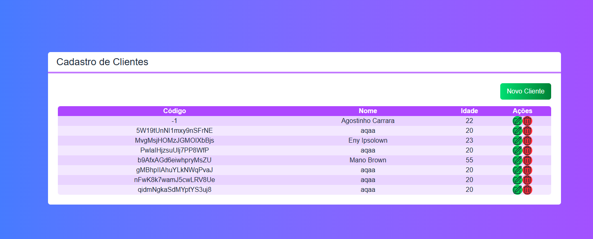
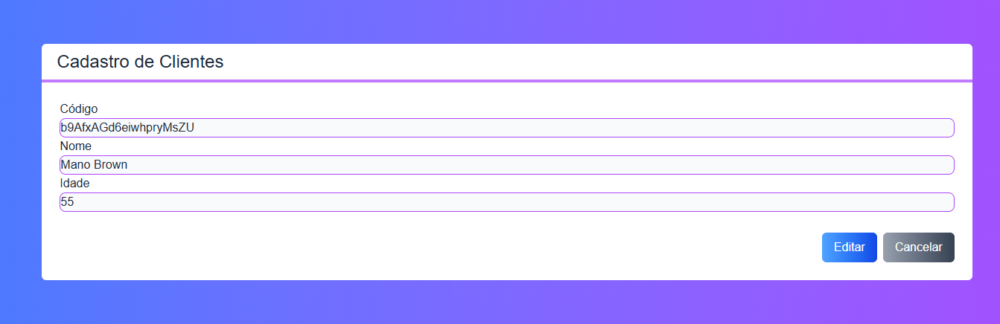
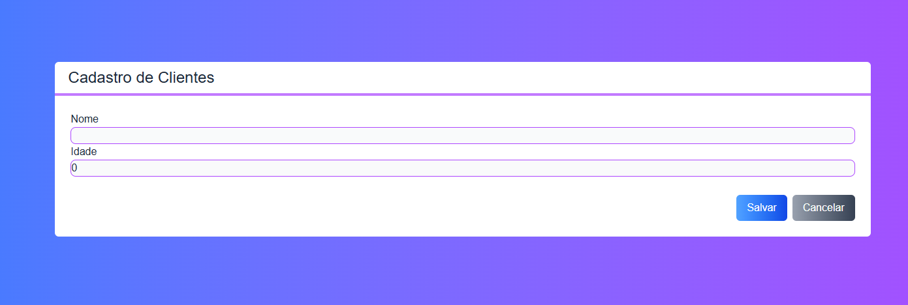

# Next CRUD

Aplicação de cadastro de clientes desenvolvida com Next.js, TypeScript e Firebase Firestore. O projeto foi construído para demonstrar um CRUD completo com listagem, cadastro, edição e exclusão de registros.

## Funcionalidades

- Listagem de clientes
- Cadastro de novos clientes
- Edição de cliente existente
- Exclusão de cliente
- Visualização em tabela com ações de edição e remoção
- Interface responsiva com Tailwind CSS
- Persistência em banco Firestore

<p align="center">
  
  
  
</p>

## Tecnologias

- Next.js 15
- React 19
- TypeScript
- Firebase Firestore
- Tailwind CSS
- ESLint

## Estrutura do projeto

```bash
next-crud/
├── public/
├── src/
│   ├── backend/
│   │   ├── config.ts
│   │   └── db/
│   │       └── ColecaoCliente.ts
│   ├── components/
│   │   ├── Botao.tsx
│   │   ├── Entrada.tsx
│   │   ├── Formulario.tsx
│   │   ├── Icones.tsx
│   │   ├── Layout.tsx
│   │   ├── Tabela.tsx
│   │   └── Titulo.tsx
│   ├── core/
│   │   ├── Cliente.ts
│   │   └── ClienteRepositorio.ts
│   ├── hooks/
│   │   ├── useClientes.ts
│   │   └── useTabForm.ts
│   └── pages/
│       ├── _app.tsx
│       ├── _document.tsx
│       ├── index.tsx
│       └── api/
│           └── hello.ts
├── .gitignore
├── eslint.config.mjs
├── next.config.ts
├── package.json
├── postcss.config.js
├── tailwind.config.js
├── tsconfig.json
├── next-env.d.ts
└── README.md
```

## Pré-requisitos

Antes de executar o projeto, certifique-se de ter instalado:

- Node.js 18+
- npm
- Conta no Firebase com projeto configurado

## Instalação

1. Clone o repositório:

```bash
git clone https://github.com/seu-usuario/next-crud.git
cd next-crud
```

2. Instale as dependências:

```bash
npm install
```

3. Configure as variáveis de ambiente:

Crie um arquivo `.env.local` na raiz do projeto com as seguintes variáveis:

```env
NEXT_PUBLIC_FIREBASE_API_KEY=sua_api_key
NEXT_PUBLIC_FIREBASE_AUTH_DOMAIN=seu_projeto.firebaseapp.com
NEXT_PUBLIC_FIREBASE_PROJECT_ID=seu_projeto_id
```

> Essas variáveis são usadas em `src/backend/config.ts` para inicializar o SDK do Firebase.

4. Crie uma coleção chamada `clientes` no Firestore do seu projeto Firebase.

## Executando o projeto

Para rodar a aplicação em modo de desenvolvimento:

```bash
npm run dev
```

A aplicação ficará disponível em:

```bash
http://localhost:3000
```

## Scripts disponíveis

```bash
npm run dev
```
Roda a aplicação em ambiente de desenvolvimento.

```bash
npm run build
```
Gera a build de produção do Next.js.

```bash
npm run start
```
Inicia a aplicação em modo de produção.

```bash
npm run lint
```
Executa a validação de lint do projeto.

## Configuração do Firebase

Este projeto utiliza o Firebase para armazenar os dados de clientes no Firestore.

A configuração inicial é feita em:

- `src/backend/config.ts`

A estrutura da coleção utilizada é a seguinte:

```json
{
  "nome": "João da Silva",
  "idade": 28
}
```

O documento recebe o `id` do Firestore automaticamente como identificador do cliente.

## Como funciona a aplicação

A página principal renderiza a tabela de clientes. A partir dela, o usuário pode:

- cadastrar um novo cliente
- editar um registro existente
- apagar um registro
- retornar para a listagem

A lógica principal fica concentrada em:

- `src/hooks/useClientes.ts`
- `src/hooks/useTabForm.ts`
- `src/components/Formulario.tsx`
- `src/components/Tabela.tsx`

## Observações

- O projeto usa o roteamento da pasta `src/pages`, padrão do Next.js pages router.
- A persistência dos dados está em Firebase, então o projeto depende do ambiente configurado do Firestore.

## Autor

Projeto desenvolvido para fins de estudo e aprendizado em Next.js com CRUD e integração com Firebase.

## Licença

Este projeto está disponível para uso educacional e pessoal. 
